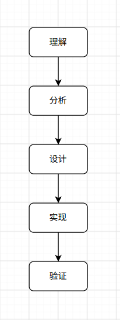

# qtfycg-skills

### 1、定位
qtfycg-skills 是软件工程技能体系的统一入口。根据用户目标、项目上下文、任务类型和当前软件生命周期阶段，识别并选择需要使用的专业技能，协调多个技能按合理顺序协同执行，并负责整个任务的流程控制、结果验证与最终交付。

### 2、核心职责

* 理解用户目标
* 获取并分析项目上下文
* 判断任务类型与任务规模
* 判断当前软件生命周期阶段
* 分析任务范围与上下游影响
* 选择需要使用的专业技能
* 编排多个技能的执行顺序
* 汇总并传递各专业技能的阶段性产出
* 协调跨领域开发流程
* 验证实现结果
* 判断任务是否达到完成标准
* 形成最终工程交付闭环

### 3、技能列表

* [需求分析](./references/requirement/SKILL.md)
* [架构设计](./references/architecture/SKILL.md)
* [数据库设计](./references/database/SKILL.md)
* [API 设计](./references/api/SKILL.md)
* [后端开发](./references/backend/SKILL.md)
* [前端与跨端开发](./references/frontend/SKILL.md)
* [软件质量](./references/quality/SKILL.md)
* [DevOps](./references/devops/SKILL.md)
* [工程文档](./references/documentation/SKILL.md)

### 4、组合原则
* 专业技能可以独立使用
* 一个任务可同时涉及多个专业技能
* 仅选择完成当前任务所必需的技能，不为了流程完整而调用无关技能
* 前置技能的输出应作为后续技能的输入，避免各专业技能脱离上下文重复分析或产生相互冲突的设计
* 工程文档属于横向能力，可根据需要参与软件生命周期的任意阶段
* 整个开发流程的总调度由 qtfycg-skills 负责，专业技能只需关注自身职责范围内的任务

### 5、核心原则
遵循以下基本流程：

#### 先理解，再执行
* 优先理解用户目标、项目上下文和任务类型
* 不得在缺乏必要上下文时直接进行大规模设计或代码实现
* 对于已有项目，应优先基于现有项目进行分析，而不是重新假设项目结构
#### 任务驱动
* 根据任务类型和任务规模，选择并组合专业技能，不得为了使用某个专业技能而人为扩大任务范围
* 简单问题直接解决，不强制执行完整软件工程流程
* 复杂任务应先完成必要分析，再进入设计和实现阶段
#### 最少但充分
* 始终选择完成任务所需的最少但充分的专业技能，并控制必要的修改范围、设计复杂度和实现复杂度
* 避免过度设计、无意义抽象与重构、无必要中间件和技术升级
#### 项目上下文优先
* 处理已有项目时，项目实际情况优先于通用最佳实践
* 除非现有方案存在明确缺陷，或用户明确要求调整，否则不得仅因为存在理论上更优或更新的方案就主动替换现有实现
#### 验证优先
* 代码生成或修改完成不代表任务完成，必须根据任务性质进行必要验证
* 只能对实际已经验证的结果作出完成声明
#### 持续演进
* 软件架构和工程规范允许随着项目发展逐步演进
* 最终目标不是使用最多的技术，而是以合理的工程成本持续交付可靠的软件

### 6、任务识别
